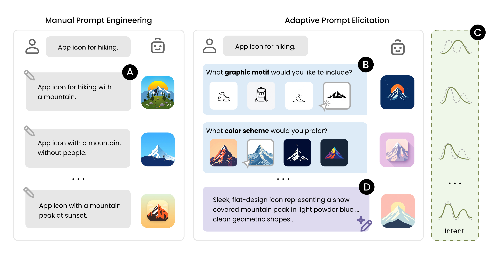
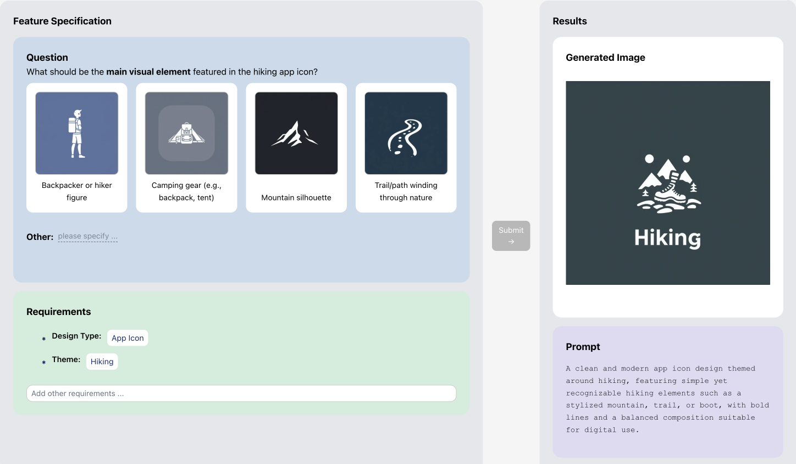

<div align="center">

# Adaptive Prompt Elicitation for Text-to-Image Generation


[](https://doi.org/10.1145/3742413.3789149)
[](https://e-wxy.github.io/Adaptive-Prompt-Elicitation/)
[](./LICENSE)
[](https://github.com/e-wxy/Adaptive-Prompt-Elicitation)




</div>

> **Adaptive Prompt Elicitation (APE)** is an interactive prompting technique that transforms text-to-image generation from manual trial-and-error into a guided visual conversation. It actively infers the user's underlying intent through adaptive visual queries, allowing general users to *craft effective prompts without extensive writing*. Learn more on the [project page](https://e-wxy.github.io/Adaptive-Prompt-Elicitation/).


## Installation

**1. Clone the repository and set up the environment:**
```bash
git clone https://github.com/e-wxy/Adaptive-Prompt-Elicitation.git
cd Adaptive-Prompt-Elicitation

conda create -n ape python=3.12 -y
conda activate ape

pip install -r requirements.txt
```

**2. Configure API keys:**

Copy the example environment file:
```bash
cp .env.example .env
```
then fill in your API keys.

APE requires an LLM API key and a Text-to-Image (T2I) API key. The default configuration uses OpenAI and fal.ai:

- `OPENAI_KEY` — OpenAI API
- `FAL_KEY` — fal.ai API

You can alternatively use other API providers. See [`.env.example`](./.env.example) for the full list of supported keys (Anthropic, Google, Vertex AI).


## Quick Start

```python
from ape import Project

# Initilise a text-to-image generation project
project = Project(
    task="App Icon",
    description="Icon design for a hiking app",
    questioner="APE",   # proposed method
)

# APE generate a visual query that maximally improve the alignment
question = project.ask_questions(json_format=False)
print(question)

# Record the user's answer and update the intent specification
project.record_answer("...")
project.extract_requirements()

print(project.get_requirements())  # visual feature requirements
print(project.img_url)             # generated image
```

See [`demo.ipynb`](./demo.ipynb) for a full interactive walkthrough.


## Web Demo

An interactive browser-based demo. See [`web/README.md`](./web/README.md) for full setup instructions.

```bash
# 1. Backend — run from the repo root
pip install -r web/requirements.txt
python web/server.py

# 2. Frontend — in a separate terminal
cd web/frontend && npm install && npm run dev
```

Open [http://localhost:3000](http://localhost:3000), enter a design type and a short description, and APE will interactively guide you through visual queries to refine the generated image.




## Repository Structure

```
Adaptive-Prompt-Elicitation/
├── ape/                        # Core package
│   ├── project.py              # Project — manages intent state and the elicitation loop
│   ├── questioners.py          # Query strategies
│   ├── utils.py                # LLMAgent and ImageGenerator (multi-provider API)
│   ├── logger.py               # Structured JSON session logging
│   └── prompt_templates/       # LLM prompt templates
├── web/                        # Interactive web demo
│   ├── server.py               # Flask REST API backend
│   ├── requirements.txt        # Backend dependencies
│   ├── README.md               # Web demo setup instructions
│   └── frontend/               # Next.js frontend
├── demo.ipynb                  # Interactive demo notebook
├── benchmark.py                # Automated benchmarking (DesignBench / IDEA-Bench)
├── eval.py                     # Similarity metrics (CLIP, DINOv2, DreamSim, E5, OpenAI)
├── requirements.txt
└── .env.example
```

## Benchmarking

Reproduce the paper's technical evaluation. To run the full experiment suite:

```bash
./run_benchmark.sh
```

Or run individual configurations:

```bash
# APE on DesignBench
python benchmark.py --dataset DesignBench --questioner APE --max-iters 15 --num-exp 5

# Interactive baseline on DesignBench
python benchmark.py --dataset DesignBench --questioner In-Context --max-iters 15 --num-exp 5 --exp-id-start 20

# APE on IDEA-Bench
python benchmark.py --dataset IDEA-Bench --questioner APE --max-iters 15 --num-exp 5
```

## Evaluation

```python
from eval import get_similarity_model

clip = get_similarity_model("clip")
score = clip.get_similarity("generated.png", "reference.png")
```

Available metrics: `"clip"`, `"dinov2"`, `"dreamsim"`, `"e5"`, `"openai"`.

For `"VQAScore"`, see [t2v_metrics](https://github.com/linzhiqiu/t2v_metrics).


## Supported GenAI APIs

| Provider | LLM | Image Generation |
|:---|:---|:---|
|  | GPT-4.1-mini *(default)*, GPT-4.1, GPT-5, GPT-5-mini | DALL-E 3, gpt-image-1 |
|  | Claude Sonnet 4, Claude Opus 4.7, Claude Haiku 4.5 | — |
|  | — | FLUX/schnell *(default)*, FLUX/dev, FLUX Pro, ... |
|  /  | Gemini 2.0 Flash Lite, Gemini 2.5 Flash, Gemini 2.5 Pro | Imagen 4 |


## Citation

If you find this work useful, please consider citing:


```bibtex
@inproceedings{wen2026adaptive,
  author = {Wen, Xinyi and Hegemann, Lena and Jin, Xiaofu and Ma, Shuai and Oulasvirta, Antti},
  title = {Adaptive Prompt Elicitation for Text-to-Image Generation},
  year = {2026},
  isbn = {9798400719844},
  publisher = {Association for Computing Machinery},
  address = {New York, NY, USA},
  doi = {10.1145/3742413.3789149},
  booktitle = {Proceedings of the 31st International Conference on Intelligent User Interfaces},
  pages = {730–754},
  numpages = {25},
  series = {IUI '26}
}
```

## License

This project is released under the [MIT License](./LICENSE).

If you build something with APE, we’d love to see it! ✨  Feel free to open a PR or share your project.